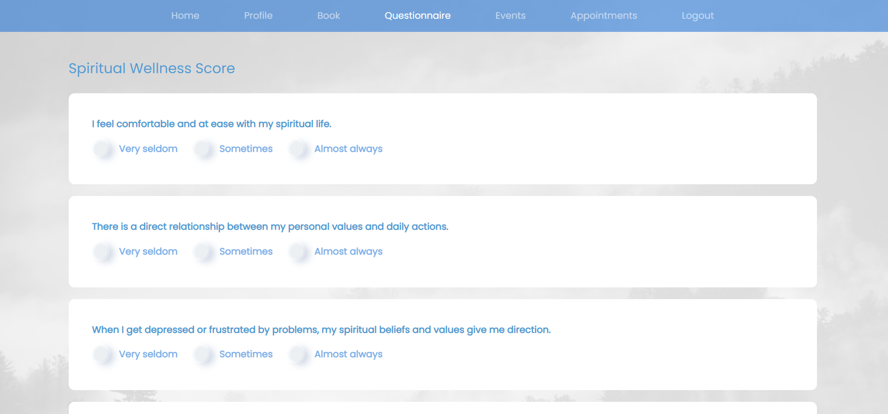

# Overview

- Our project brings comfortable counseling to students.
- Spreads awareness of mental health issues and encourages the practice of seeking help.
- It is a fully-featured website that brings together chaplains and students.
- It is a user-friendly, confidential, system, that builds a safe community.
- Includes appointment booking, events, timesheet, and spiritual wellness score modules.

## 1. Sign-up Feature

The sign-up feature is added for the DMS Users to be able to register themselves to DMS. After registration, the user will be able to login into the system by entering their registered email and password. Two kinds of users can register into our system - Students of Dalhousie University and chaplains working for DMS.
The chaplain will enter his/her information such as First Name, Last Name, Religion, Description, Phone Number, Email, Password.

## 2. Login Feature

The login feature is added for the DMS Users to be able to login-in to DMS. This feature is developed using React-js. Aside from login, forgot password with O.T.P verification is also provided. The user must register himself to be able to login into the system. Two kinds of users can login into our system; Students of Dalhousie University and chaplains.
If the user enters a valid registered email and password he/she will be logged in to the system depending on whether it’s a chaplain login or student login.

## 3. Password Modification Feature

Our system has 2 different types of users – Chaplin and Students. A user can register in DMS using an email address that has dal.ca in the end. If for some reason the user is not able to remember the password correctly, they have a one-time password-based recovery option. One needs to enter their dal email and they will get an email with a 6-digit numeric code on their registered email. In the next step, they can enter that OTP and set a new password for their account.
If a user clicks on the forget password link, he/she will be directed to the Password recovery page.
An email is received to the registered user, it has a 6-digit one-time password for authenticating the identity of the user.
One has to set a new password and a confirmed password should match the new password to be accepted and updated.
Once, the new password is updated, they are redirected to the login page so that they can easily login into their account.

## 4. Appointment Booking Feature

The appointment booking feature is a complete booking flow that starts from selecting chaplains, booking slots, and then the chaplain confirming or rejecting the booked slots.
The list of chaplains can be viewed by clicking the Chaplains option in the header.
Next, on clicking book, the time slots of each chaplain will be available.
On selecting the slot, the book option will be enabled.
On clicking on Book Appointment, the confirmation modal opens.
A modal showing that an email for booking confirmation is sent will appear.
The email is sent using Email.js.
Once the slot is confirmed, it will reflect on the history of appointments in user and chaplain views. There are three different appointment statuses – pending, confirmed, and rejected.
Once the chaplain confirms or rejects the appointment it will reflect on the student’s view.

## 5. Upcoming Events Feature

The events feature has been designed to let the users know about spiritual events that they can participate in. The events can be viewed and added by both students and chaplains. On clicking the Add Event button on the right corner a modal opens that allows the users to enter details about the event.
The upcoming events can be seen by clicking the events tab on the header. A grid of event cards is displayed. The card contains details such as name and date.
Clicking on a specific events card will open another page that gives a detailed description of the event. The details such as event name, address, date and time, the number of seats available and a description of the event. It also provides a button to allow booking.

## 6. Timesheet Feature

The timesheet feature is added for the DMS staff members to document the hours they have worked. This feature is developed using React-big-calendar. It is a calendar component for managing events and dates. The moment is used as a localizer to format dates and times to the appropriate time zones. The calendar offers different views such as – Month, Week, Work Week, Day, and Agenda. The timesheet can only be viewed by the staff and cannot be edited once created.
On clicking the Add Event button, the chaplains can add the details of the student they have met, and the date and time slots. Once the slot is added, it can be viewed in the views mentioned previously.

## 7. Spiritual Wellness Score Feature

“Spiritual Wellness Score” feature is provided for students. The goal of this feature is to achieve balanced wellness. It helps measure spiritual wellness by asking several questions related to mental health. A user will be asked nine questions. Each question has three options:
(1) Very seldom
(2) Sometimes/occasionally
(3) Almost always
Each option has different points. Based on these points, the final score is calculated, and the result is given to the user. A score between 13 and 18 points is considered an excellent strength in the dimension. A score between 7 and 12 points depicts room for improvement. And the score below 7 points suggests a lot of work is required.
The student needs to answer all the questions, and the result will be shown in the modal based on the points scored. The resulting modal contains a progressive bar showing the points scored.
If the user tries to calculate the score without attempting all the questions, then the website will prompt a message to complete all the questions before clicking on calculate button.

## 8. Edit Profile Feature

‘Edit Profile’ feature lets users change their personal details like their first name, last name, mobile number, password, etc. Dalhousie Multifaith Services (DMS) provides a separate profile page where users can see their details and edit them.

### 8.1 Student Profile

Students need to provide their first name, last name, mobile number, institutional email, and password while registering on DMS. These details can be seen on their profile page.
On clicking the edit icon, a modal will pop up, letting the users (students) edit their first name, last name, mobile number, and password.
Users can change any specific detail or all the details simultaneously. If users want to change their name or mobile number, they need to confirm the changes by providing their existing password. For updating the password, the users need to enter a new password and re-enter it for confirmation.
After making the required changes to the profile details, clicking on the update button will validate the new information and password. Once the validation is successful, it will update the information. Figure 1.4 shows the profile page after the update.

### 8.2 Chaplain Profile

Chaplains need to provide their first name, last name, mobile number, institutional email, Religion, Description, and password while registering on DMS. These details can be seen on their profile page.
On clicking the edit icon, a modal will pop up, letting the users (chaplains) edit their first name, last name, mobile number, religion, description, and password.
Like students, chaplains can also change any specific detail or all the details simultaneously. If chaplains want to change their name, religion, or mobile number, they need to confirm the changes by providing their existing password. For updating the password, the chaplains need to enter a new password and re-enter it for confirmation.
After making the required changes to the profile details, clicking on the update button will validate the new information and password. Once the validation is successful, it will update the information.
